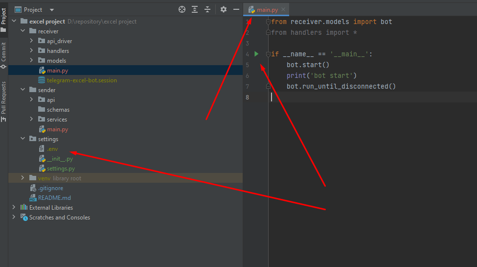
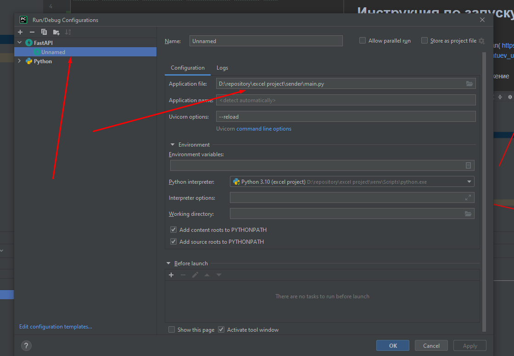

# Проект "Обработка данных в Excel"

Подсчет количества пропущенных сотрудниками рабочих дней

# Как вести разработку

Разработка будет вестись в ветке dev/ветка фичи, псле завершения работы, кидается пул реквест на дев, я буду код ревью
делать

# Инструкция по запуску проекта (для разработчиков)(картинки находятся в папке ридми файл)

1) установить все неустановленные пакеты проекта + uvicorn

2) в папку settings нужно положить этот
   файл( https://urfume-my.sharepoint.com/:u:/g/personal/makar_batuev_urfu_me/EZLOlezmttRPvPjFwqfJKa0BG6glM2PVeojOXZ06GSinHw?e=sUVEX3 )

3) потом в мейне сендера запустить приложение

4) должно быть как то так 

5) чтобы заупстился апи(receiver) нужно сделать такой конфиг в пайчарме , это
   запуститься апи. после запуска по урлу  http://127.0.0.1:8000/docs должен открываться свагер, где нужно дебажить
   контроллер методы.

### по всем возникшим вопросам пишите в вк 
